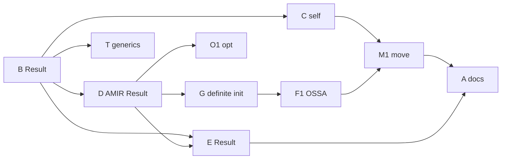

# Arandu Compiler Architecture — Roadmap v0.1 → v0.2

**Fonte única de verdade (checklist executivo).** Decisões e riscos: [arandu-strategic-plan-v0.1.md](./arandu-strategic-plan-v0.1.md).

| Documento | Status |
|-----------|--------|
| `arandu-strategic-plan-v0.1.md` | **Síntese** — decisões, bugs, papers, fases |
| `arandu-language-model-rfc-v0.1.md` | **Substituído** — decisões absorvidas no plano + aqui |
| `arandu-ir-architecture-v0.1.md` | Referência técnica de IR |
| `arandu-amir-v0.1.md` | Contrato AMIR + invariantes formais |
| `README.md` Next Steps | Atualizar para apontar para este arquivo |

---

## Painel de progresso (atualizar a cada PR)

Legenda: `[x]` feito · `[~]` parcial · `[ ]` não iniciado

### Pipeline

| Passo | Estado | Notas |
|-------|--------|-------|
| Lexer | `[x]` | Recovery, spans, semicolon insertion |
| Parser → AST | `[x]` | v0.1 slice; `self`, `Result` como tipo |
| Name resolver | `[x]` | N001–N006 |
| Type checker | `[x]` | `Result<T,E>`, `Option<T>`, interner (`TypeId`) |
| AHIR | `[x]` | Golden `tests/hir/` |
| AMIR CFG | `[x]` | Dominators tree, strict SSA registers vs stack slots |
| Definite init | `[x]` | lattices, InitBits flow, O008 diagnostic |
| Move checker | `[~]` | Move state annotation, verification pass pending |
| Middle-end opt | `[ ]` | Previsto v0.1 neste roadmap |
| Backend C | `[ ]` | v0.2 |
| Backend LLVM | `[ ]` | v0.4+ |

### v0.1 — checklist resumido

```
BLOQUEADOR
[x] B  Result<T,E> + Option<T> no type checker

PARALELO / APÓS B
[x] C  self receiver (own | mut | shared)
[x] T  Generics instantiation + interface/where + Monomorphization graph
[x] D  AMIR ?/errdefer em Result (layout ok/err + ResultCtor)

ANÁLISE (após AMIR estável)
[x] TC Modularizar type checker (ver plano §5)
[x] BUG Críticos checker (T022–T023, catch, ??, array) — plano §7.1
[x] G  Definite initialization (O008)
[x] F1 OSSA básico (move, copy, destroy) (instructions and core structures in place)
[ ] M1 Move checker básico (O001, O005, O007)
[ ] O1 Constant folding + DCE

FECHAMENTO v0.1
[x] D2 AMIR desugaring (match/defer/?/Result; SwitchInt formal para int/enum/bool)
[x] E  só `Result<T,E>` + T019; parser **P006** para retorno inválido
[ ] A  Docs/README alinhados a este roadmap
```

---

## 1. Identidade da linguagem

Arandu é uma linguagem de sistemas com:

- Ergonomia próxima de Swift e Vale
- Pipeline de compilador inspirado em Rust e Swift SIL
- Filosofia pragmática estilo Zig
- Ownership híbrido: checker intraprocedural + generational fallback
- Sem borrow checker completo estilo Rust (sem lifetimes, sem NLL)
- Sem GC

O objetivo não é superar Rust em pureza de análise estática.  
É ser a linguagem mais produtiva que ainda oferece segurança de memória real para os casos de uso de ~90% — web, desktop, CLI, servidores, jogos.

---

## 2. Pipeline completo (visão definitiva)

```
Source (.aru)
    ↓
  Lexer              error recovery, spans, semicolon insertion
    ↓
  Parser → AST       recursive descent + Pratt, error nodes
    ↓
  Name Resolver      symbol table hierárquica, 2 passes, N001–N006
    ↓
  Type Checker       bidirectional HM, Result<T,E>, self, T001–T018
    ↓
  AHIR               typed AST, generics preservados, spans
    ↓
  AMIR               CFG + SSA + OSSA, blocos básicos
    ↓
  Definite Init      reaching definitions, O008
    ↓
  Move Checker       MoveState, aliasing, gen check insertion, O001–O007
    ↓
  Middle-end Opt     constant folding, DCE, inlining  [v0.3+ inlining]
    ↓
  Backend debug      C como target intermediário      [v0.2]
    ↓
  Backend release    LLVM IR                          [v0.4+]
```

---

## 3. Decisões arquiteturais fixas

Estas decisões **não mudam** entre versões.

### 3.1 AHIR → AMIR split

| IR | Papel |
|----|--------|
| **AHIR** | Semântica humana — typed AST, generics preservados |
| **AMIR** | Fluxo e memória — CFG + SSA + OSSA |

Alinhado com: Rust HIR/MIR, Swift SIL/OSSA, Kotlin FIR/KIR.

### 3.2 CFG antes de ownership

Ordem obrigatória: `AST → AHIR → AMIR (CFG) → ownership checker`.  
Ownership no AST isolado = beco sem saída.

### 3.3 SSA cedo

Benefícios: otimização, liveness, ownership, dataflow, regalloc.  
Em SSA, interference graphs são cordais → regalloc O(V+E).

### 3.4 OSSA — ownership como fluxo, não tipo

Arandu segue Swift OSSA no AMIR: `move`, `copy`, `borrow_*`, `destroy` são **instruções**, não só anotações de tipo.

### 3.5 Error recovery em todo passo

Lexer → error tokens; Parser → error nodes; Type checker → `ArType::Error` (poison).  
Múltiplos erros reais por compilação, sem cascata.

### 3.6 Interfaces estruturais nominais

Nominal por padrão; structural **só** para interfaces (Go/Swift/Rust traits).  
**Não:** structural typing universal estilo TypeScript.

### 3.7 AHIR público e estável (a partir de v0.2)

- Serializable (`serde`)
- Versionado (`AhirV1Program`)
- Crate `arandu_hir` com semver

### 3.8 Fora de escopo (v0.x)

- Borrow checker interprocedural estilo Rust
- Lifetimes na superfície, NLL, regiões obrigatórias
- Variância em genéricos
- Structural typing universal
- Green tree / rowan (v0.3+)
- Query system / incremental (v0.3+)
- Comptime (v0.4+)
- GHC rewrite rules / e-graphs (v0.4+)

---

## 4. v0.1 — escopo e tarefas

v0.1 = compilador que **analisa** programas reais com `Result`, métodos, interfaces e ownership **básico**.

Cada subseção tem: **meta · dependências · arquivos · testes · critério de pronto · checkbox**.

---

### 4.B — `Result<T,E>` e `Option<T>` [BLOQUEADOR]

**Dependências:** nenhuma (começar aqui).

**Por que bloqueia tudo:** `?`, `errdefer`, diagnósticos e AMIR v0.2 dependem de `Result<T,E>` explícito (parser **P006** rejeita retorno tupla-erro).

#### Implementar

| Camada | Tarefa | Arquivo(s) |
|--------|--------|------------|
| Tipos | `ArType::Result(T, E)`, `Option<T>` ou semântica clara de `Nullable` | `type_checker/types.rs` |
| Parser | Tipo `Result<int, ParseError>` | `parser/types.rs` |
| Checker | `?` só em `Result` / `Option`; T016 atualizado | `type_checker/check.rs` |
| HIR | `Ok`/`Err`/`Some`/`None` | `hir/mod.rs`, `lower_hir.rs` |
| Retorno | Só `Result<T,E>`; tupla-erro → **P006** no parser | `parser/types.rs`, `types/unify.rs` |

```rust
// Alvo em types.rs
ArType::Result(Box<ArType>, Box<ArType>)
// Option: ArType::Option ou Nullable com regra separada de Err
```

#### Testes

- [ ] `tests/type_checker/result_ok.aru`
- [ ] `tests/type_checker/result_err.aru`
- [ ] `tests/type_checker/result_propagation.aru`
- [ ] `tests/type_checker/option_some.aru`

#### Critério de pronto

- [ ] Programas usando **só** `Result` passam em `cargo test -p arandu_semantics`
- [ ] `?` rejeita tipos não-`Result` com T016 + hint

**Checkbox fase:** `[~] B` — type checker feito; ver critérios abaixo

**Feito nesta entrega:**
- [x] `ArType::Result`, `ArType::Option`
- [x] `Result<T,E>` / `Option<T>` no parser (generics)
- [x] `?` em `Result` e `Option`
- [x] `Result.Ok` / `Result.Err` / `Option.Some` (type checker)
- [x] Retornos de erro só via `Result<T,E>` (incl. `Result<void, Err>`)
- [x] Testes `tests/type_checker/result_*.aru`, `option_some.aru`

**Ainda fora:**
- [x] AMIR `?` / `errdefer` via `Result`
- [x] **P006** rejeita retorno tupla-erro no parser
- [x] T019 `Result` ignorado (`config = f()` sem `?`)
- [ ] `Result.Err` no parser (token `Err` como membro)

---

### 4.C — `self` receiver [bloqueador de métodos]

**Dependências:** pode paralelizar com final de **B**.

#### Implementar

| Camada | Tarefa | Arquivo(s) |
|--------|--------|------------|
| Lexer | keyword `self` | `lexer/ident.rs` |
| Parser | `func User.greet(shared self) str` | `parser/decl.rs`, `ast/decl.rs` |
| Ownership enum | `Shared` (+ alinhar `borrow` → `shared` na doc) | `ast/decl.rs` |
| Resolver | `user.greet()` → `User.greet(shared user)` | `name_resolution.rs` |
| HIR | `is_receiver`, `ReceiverKind` | `hir/mod.rs` |
| AMIR | slot dedicado para receiver | `lower_amir.rs` |

**Regras:**

| Receiver | Semântica |
|----------|-----------|
| `shared self` | Leitura compartilhada |
| `mut self` | Escrita exclusiva |
| `own self` | Consome o valor |

#### Testes

- [x] `tests/parser/method_self.aru` → `.ast` golden
- [x] `tests/hir/method_self.aru` → `.hir`
- [x] `tests/amir/method_self.aru` → `.amir`
- [x] `tests/type_checker/method_shared.aru`
- [x] `tests/type_checker/method_mut.aru`
- [x] `tests/type_checker/method_own.aru`

#### Critério de pronto

- [x] Sem parâmetro manual duplicado `func User.f(user User)`
- [x] Diagnóstico claro se `self` ausente onde obrigatório

**Checkbox fase:** `[x] C completo`

---

### 4.T — Generics + interface satisfaction

**Dependências:** **B** estável o suficiente para tipos em constraints.

#### Implementar

- [ ] Instanciação: `List<int>` → `List<T>` com `T = int`
- [ ] Versão especializada no AHIR (prep. monomorphization)
- [ ] Constraint: `T: Ordered` → verificar satisfação
- [x] Interface satisfaction (Go-style): métodos faltantes → **T025**
- [x] Constraints `T: Interface` + `where` em params/decls → **T011** / **T025**

**Arquivos:** `type_checker/check.rs`, `type_checker/synth.rs` (se existir ou criar).

#### Critério de pronto

- [ ] Exemplo com `interface` + struct que não implementa → T018 com lista de métodos

**Checkbox fase:** `[ ] T completo`

---

### 4.G — Definite initialization

**Dependências:** AMIR CFG estável (**D2**).

#### Algoritmo

Reaching definitions por basic block:

```text
IN[B]  = ∪ OUT[pred]
OUT[B] = GEN[B] ∪ (IN[B] - KILL[B])
```

- **O008** — uso antes de init
- Primitivos: zero-value implícito
- `own`: sem zero-value — deve init explícito

**Arquivo novo:** `passes/definite_init.rs`

**Checkbox fase:** `[ ] G completo`

---

### 4.F1 — OSSA básico no AMIR

**Dependências:** **G** recomendado (init antes de move).

#### Instruções Core OSSA no AST do AMIR

O AMIR já possui suporte a instruções e RValues estruturados para OSSA, servindo de fundação natural para o **Ownership Checker** e **Escape Analysis**:

```rust
// Em stmt.rs (AmirStmt)
AmirStmt::StorageLive(LocalId)   // Marca início do tempo de vida lógico na pilha
AmirStmt::StorageDead(LocalId)   // Marca fim do tempo de vida lógico na pilha
AmirStmt::Destroy(AmirPlace)     // Destruição/drop explícito de valor owned

// Em value.rs (AmirRvalue / AmirOperand)
AmirRvalue::Borrow(AmirPlace)     // Shared reference (&place)
AmirRvalue::BorrowMut(AmirPlace)  // Mutable reference (&mut place)
AmirOperand::Move(TempId)         // Semântica de Move (invalida temporário origem)
AmirOperand::Copy(TempId)         // Semântica de Copy (tipos primitivos/shared)
```

Mesmo que inicialmente essas instruções sejam geradas e tratadas de forma simplificada no pipeline, ter essa modelagem estrita em AMIR garante que:
- O **Move/Ownership Checker** seja construído diretamente em cima do CFG (intra e interprocedural).
- O **Escape Analysis** nasça de forma natural ao rastrear onde as referências geradas por `Borrow` e `BorrowMut` vazam para fora da pilha (`StorageDead` / retornos).

**Arquivos:** `amir/stmt.rs`, `amir/value.rs`, `amir/pretty.rs`, `passes/definite_init.rs`

**Checkbox fase:** `[x] F1 completo`

---

### 4.M1 — Move checker intraprocedural (básico)

**Dependências:** **F1**.

```rust
enum MoveState { Owned, Moved, Uninitialized }
```

| Código | Regra |
|--------|-------|
| O001 | uso após move |
| O005 | double-free |
| O007 | move inconsistente entre branches |
| O008 | (com G) uso antes de init |

**Arquivo novo:** `passes/move_checker.rs`

**Checkbox fase:** `[ ] M1 completo`

---

### 4.O1 — Constant folding + DCE

**Dependências:** AMIR SSA-like (locals `_N`).

**Arquivo novo:** `passes/optimize.rs` (~150 linhas)

- [ ] Fold: `_3 = add _1, _2` com literais conhecidos
- [ ] DCE: defs sem uses em SSA

**Checkbox fase:** `[ ] O1 completo`

---

### 4.D — AMIR desugaring v0.2

**Dependências:** **B** para `errdefer` e `?` corretos sem heurística.

#### Status no repositório (baseline)

| Feature | Estado repo | Falta |
|---------|-------------|-------|
| `match` / `if is` | `[x]` | — (`SwitchInt` int/enum; ranges/guards em cadeia) |
| `defer` | `[x]` | Escopos OK; ligado a **B** para errdefer sem heurística |
| `errdefer` | `[x]` | `Result.Err` + `nil` em `Result<void, E>` |
| `?` | `[x]` | `Result` (`_1` err) + `Option`/`T?` (nil) |
| `?.` `?[]` `??` | `[x]` | — |
| `for in` | `[x]` | — |
| `alloc` / `free` | `[x]` | — |
| `catch` | `[ ]` | — |

#### Após **B** — refatorar

- [x] `?` → campo `_1` err em `Result<T,E>` (repr. tupla ok/err)
- [x] `errdefer` → `Result.Err` / `expr_is_result_err`
- [x] `Result.Ok`/`Err`/`Option.Some` → `HirExprKind::ResultCtor`
- [x] `match` enum → `SwitchInt` para variantes unitárias (`match_lower.rs`)

**Arquivo:** `passes/lower_amir/match_lower.rs`, `passes/lower_hir.rs`, `tests/amir/*`

**Checkbox fase:** `[x] D2` (SwitchInt + Result + defer/?)

---

### 4.E — `Result` canônico

**Dependências:** **B**, **D2**.

- [x] Retorno tupla-erro rejeitado no parser (**P006**)
- [x] `value, err = f()` desestrutura `Result`
- [x] **T019** se `config = f()` sem `?`
- [x] `Result<void, Err>`, `Result.Ok` / `Result.Err` no parser
- [x] Migrar `examples/stable/**` e testes

**Checkbox fase:** `[x] E`

---

### 4.A — Alinhar documentação

- [ ] `README.md` — status real, link para este roadmap
- [ ] `arandu-ir-architecture-v0.1.md` — AMIR suportado vs planejado
- [ ] `arandu-examples-validation-v0.1.md` — alinhar exemplos a `Result<T,E>`
- [ ] Arquivar ou redirecionar `arandu-language-model-rfc-v0.1.md` → este doc

**Checkbox fase:** `[ ] A completo`

---

### 4.P — Pendências Técnicas, Bugs Críticos e Escalabilidade

#### Bugs e Melhorias de IR
- [x] **BUG-01 — Array mismatch silencioso**: Mismatch em literals de array agora propaga `ArType::Error` corretamente, evitando cascading typecheck errors silenciosos.
- [ ] **BUG-02 — AmirProjection::Field com SymbolId**: Mudar `AmirProjection::Field(String)` para `AmirProjection::Field(SymbolId)` para garantir comparação de campos em O(1) no move checker.
- [ ] **BUG-03 — Enforce de Move vs Copy**: Garantir que o lowering marque e invalide temporários movidos, preparando o move checker.

#### Escalabilidade e Performance
- [~] **SCALE-01 — InstantiationGraph & Ciclos**: Estrutura robusta de `InstantiationGraph` e detecção de ciclos DFS implementados e testados em `passes/monomorphize.rs`. Resta a integração final no pipeline do compilador.
- [ ] **SCALE-02 — TypeInterner no TypeChecker**: Integrar o interner no `TypeChecker` substituindo `ArType` por `TypeId` em mapas internos como `expr_types` e `decl_types` para garantir igualdade em O(1).
- [ ] **SCALE-03 — Lattices eficientes no Definite Init**: Substituir `Vec<bool>` por `u64` ou estrutura compacta de bitset em `InitBits` para suportar 64+ locais de forma cache-friendly.

**Checkbox fase:** `[~] P`

---

## 5. v0.2 — escopo

| ID | Entrega | Novo? |
|----|---------|-------|
| F2 | OSSA completo: `borrow_shared`, `borrow_mut`, `end_borrow` | amir.rs |
| M2 | Move checker: O002, O003, O006 | move_checker.rs |
| G2 | Generational fallback + O004 (nota, não erro) | `passes/gen_check.rs` |
| M3 | Move interprocedural básico (chamadas) | move_checker.rs |
| BC | Backend C | crate `arandu_backend_c/` |
| SL | Stdlib mínima | crate `arandu_std/` |
| HP | AHIR pública + serde + `arandu_hir` | extrair crate |

### Critério v0.2

- [ ] Todos `examples/stable/` compilam via backend C

**Checklist v0.2:**

```
[ ] F2  OSSA borrow completo
[ ] M2  Move checker O002–O006
[ ] G2  Generational insertion
[ ] M3  Move interprocedural básico
[ ] BC  Backend C
[ ] SL  arandu_std
[ ] HP  arandu_hir + JSON estável
```

---

## 6. Deferred (v0.3+)

| Feature | Versão | Motivo |
|---------|--------|--------|
| Query system / incremental | v0.3 | Semântica estável primeiro |
| LSP (`arandu-analyzer`) | v0.3 | AHIR estável + incremental |
| Green tree / rowan | v0.3 | Formatter exato |
| Inlining middle-end | v0.3 | Após DCE estável |
| LLVM IR | v0.4 | C debug primeiro |
| egglog / e-graphs | v0.4+ | Middle-end maduro |
| Comptime | v0.4+ | Checker + lowering estáveis |
| PGO + LTO | v0.5+ | LLVM maduro |
| Bootstrap em Arandu | v0.6+ | Backend release estável |

---

## 7. DiagCodes — mapa completo

### N-series — Name Resolution `[x]`

| Code | Descrição |
|------|-----------|
| N001 | identifier não declarado (+ sugestão) |
| N002 | redeclaração no mesmo escopo |
| N003 | tipo usado como valor |
| N004 | valor usado como tipo |
| N005 | import não encontrado |
| N006 | conflito de import |

### T-series — Type Checker `[~]`

| Code | Descrição | v0.1 |
|------|-----------|------|
| T001–T010 | inferência, assign, call, return, ops, nullable, if/match, bool, cast | `[x]` |
| T011 | generic constraint / where inválido | `[x]` |
| T012–T016 | args, named args, any, widening, `?` inválido | `[x]` |
| T017 | index inválido (reservado) | `[x]` |
| T018 | campo inexistente (reservado) | `[x]` |
| T025 | interface não satisfeita (Go-style) | `[x]` |

### W-series — Warnings

| Code | Descrição | v0.1 |
|------|-----------|------|
| T019 | Result não tratado (`x = f()`) | `[x]` |
| P006 | retorno inválido (tupla-erro / `Err` no result) | `[x]` parser |
| W002 | `self` ausente em método | `[ ]` |

### O-series — Ownership

| Code | Descrição | Versão |
|------|-----------|--------|
| O001 | uso após move | v0.1 |
| O002 | move de emprestado | v0.2 |
| O003 | borrow mut com refs ativos | v0.2 |
| O004 | nota: gen check inserido | v0.2 |
| O005 | double-free | v0.1 |
| O006 | free de emprestado | v0.2 |
| O007 | move inconsistente entre branches | v0.1 |
| O008 | uso antes de init | v0.1 |

---

## 8. Mapa de arquivos

### v0.1

| Fase | Paths |
|------|-------|
| B | `semantics/type_checker/types.rs`, `check.rs`, `lower_hir.rs` |
| C | `parser/decl.rs`, `parser/types.rs`, `name_resolution.rs`, `hir/mod.rs` |
| T | `type_checker/check.rs` |
| G | `passes/definite_init.rs` **(novo)** |
| F1 | `amir.rs`, `passes/lower_amir.rs` |
| M1 | `passes/move_checker.rs` **(novo)** |
| O1 | `passes/optimize.rs` **(novo)** |
| D | `passes/lower_amir.rs`, `tests/amir/*` |
| E | `lower_hir.rs`, `examples/stable/` |

### v0.2

| Fase | Paths |
|------|-------|
| F2, M2, G2 | `amir.rs`, `move_checker.rs`, `gen_check.rs` |
| BC | `arandu_backend_c/` **(novo crate)** |
| SL | `arandu_std/` **(novo)** |
| HP | `arandu_hir/` **(extrair)** |

---

## 9. Ordem de execução (grafo)



**Regra:** ninguém implementa **M1** antes de **F1**; ninguém fecha **D2** sem **B**.

---

## 10. Decisões fechadas (v0.1)

Ver detalhes em [arandu-strategic-plan-v0.1.md](./arandu-strategic-plan-v0.1.md).

| # | Decisão | Estado |
|---|---------|--------|
| 1 | Sintaxe `Result<T, E>` (PascalCase) | `[x]` |
| 2 | Erro tipado livre (`Result<int, ParseError>`) + namespace `err.new` | `[x]` |
| 3 | Tríplice: `T?` = Nullable, `Option<T>` = valor, `Result<T,E>` = computação | `[x]` |
| 4 | Retorno só `Result<T,E>`; **P006** no parser | `[x]` |
| 5 | Receiver `shared` / `mut` / `own` | `[x]` |
| 6 | Ownership no AMIR (não no checker) | `[x]` |
| 7 | Polonius = insight CFG, não Datalog | `[x]` |
| 8 | Módulos multi-file | `[ ]` v0.2 |

### Backlog de bugs

Priorização completa: **plano estratégico §7**. Críticos: break/continue, `free`, `catch`, `??`, array mismatch.

---

## 11. Como acompanhar (workflow)

1. **Escolher ID** da seção 4 (ex.: `4.B`).
2. **Abrir PR** com título `[v0.1-B] Result no ArType`.
3. **Marcar checkboxes** neste arquivo + painel §Painel de progresso.
4. **Adicionar testes** listados na subseção antes de merge.
5. **Regenerar goldens** se AMIR/HIR mudar: `UPDATE_GOLDEN=1 cargo test -p arandu_semantics test_amir_golden_files`.

### Comandos úteis

```bash
cargo test -p arandu_semantics
cargo test -p arandu_semantics test_amir_golden_files
cargo test -p arandu_parser
cargo clippy --all-targets --all-features -- -D warnings
```

---

## 12. Histórico de revisões

| Data | Mudança |
|------|---------|
| 2026-05 | Roadmap v0.1 criado; absorve language-model-rfc; painel com status AMIR defer/match/? |
| 2026-05 | Plano estratégico v0.1; invariantes AMIR; decisões Nullable/Option/Result; backlog bugs |

---

*Mantenha o §Painel de progresso atualizado a cada merge relevante.*
