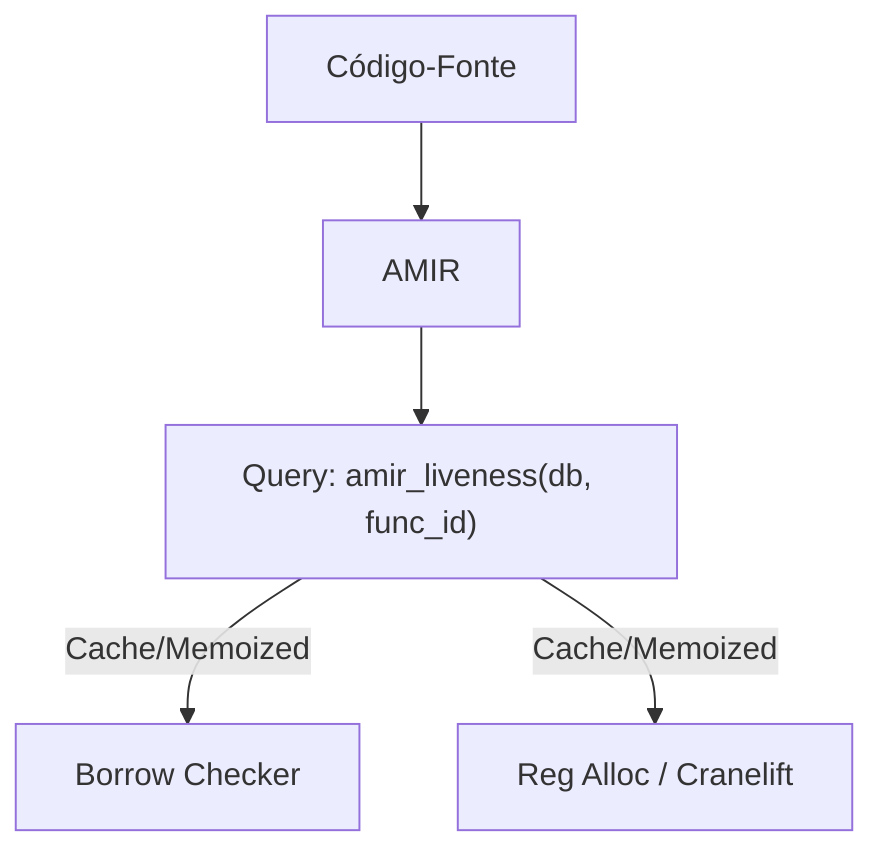

# RFC: Arquitetura de Integração Salsa (A1) — Compilação Incremental de Alta Granularidade

Este documento define as decisões arquiteturais e princípios de design para a integração do motor de compilação incremental **Salsa** no compilador Arandu (Fase 3, Milestone A1).

---

## 🏛️ O 6º Invariante Arquitetural do Arandu
Para expandir os 5 Invariantes originais, estabelecemos a seguinte regra canônica:

> **6. Single Source of Identity (Identidade Única de Salsa)**: 
> O Salsa não introduz identidades paralelas. Toda entidade rastreada ou internada pelo Salsa utiliza os tipos `IndexVec` e IDs nativos de 32 bits do Arandu (`TypeId`, `SymbolId`, `LocalId`, `BlockId`) como chaves de consulta. O Salsa opera puramente como uma camada fina de memoização e cache de invalidação sobre as estruturas existentes, sem criar duplicatas do tipo `salsa::Id` para estruturas que o compilador já identifica nativamente.

---

## 🎯 1. Granularidade por Bloco Básico (Memoização Fina)

Diferente de compiladores mainstream como o `rust-analyzer` (que memoizam no nível de itens de arquivo, ex: reprocessando uma função inteira ao alterar uma linha de código), o Arandu implementa a **memoização no nível de blocos básicos do CFG**.

Como o Arandu possui:
* Uma representação intermediária baseada em grafo de fluxo de controle estável (AMIR em RPO - *Reverse Post Order*).
* Análise de fluxo de dados (dataflow) baseada em bitsets densos por bloco.

As queries do Salsa são desenhadas para computar e cachear os fatos de fluxo de dados por bloco individual:

```rust
#[salsa::tracked]
fn block_dataflow_facts(db: &dyn Db, func_id: SymbolId, block_id: BlockId) -> DataflowFacts {
    // Computa a função de transferência para um único bloco básico.
    // Se o programador editar código dentro do bb3, apenas block_dataflow_facts(bb3)
    // e os blocos dependentes no grafo do CFG são recalculados.
}
```

Isso garante que o processamento incremental seja executado com a menor granularidade possível na teoria de compiladores.

---

## 🔄 2. Consulta de Liveness Compartilhada (Unificação MIR/Backend)

Como a representação intermediária AMIR é estruturada em SSA (Static Single Assignment) por construção (via algoritmo de Braun et al.), a análise de liveness (sobrevida de variáveis) é computada uma única vez e cacheada pelo Salsa.

A mesma query de liveness atende a dois propósitos distintos:
1. **Borrow Checker (Fase 3)**: Determinar as janelas de tempo de vida das referências de empréstimo.
2. **Register Allocator (Backend Cranelift)**: Decidir o mapeamento de registradores físicos no codegen do Cranelift.



Isso elimina redundância e reduz o custo computacional no pipeline de otimização/geração.

---

## 🔍 3. Diagnósticos e Explicação Causal (DX.5) via Tracing Nativo

Para evitar acoplamento com APIs internas e instáveis do motor do Salsa para introspecção de dependências, o Arandu implementa a funcionalidade **DX.5 (Causal-Chain Explain-Rebuild)** reaproveitando a infraestrutura de instrumentação existente (PERF.2/PERF.3):

* As 22 funções críticas já anotadas com `#[instrument]` geram spans de tracing em tempo de execução.
* Durante a execução das consultas do Salsa, os spans de tracing são anotados com as chaves de query ativas (ex: `salsa_query="check_function" symbol_id=42`).
* A explicação causal de "por que uma query recompilou" é extraída por meio da árvore estruturada de spans do log em memória, sem depender da API interna do Salsa.

---

## ⚖️ 4. Determinismo de Diagnósticos em Queries Paralelas

O Salsa suporta a execução paralela de consultas independentes. No entanto, a ordem de conclusão das tarefas concorrentes não é determinística, o que poderia fazer com que a ordem de exibição de erros ou avisos (diagnósticos) variasse entre compilações.

Para manter a promessa de **Builds Determinísticos (DET)**:
1. Todas as queries de validação acumulam diagnósticos em coletores isolados por consulta.
2. Ao final da execução paralela de queries, a CLI do compilador realiza uma **reordenação lexicográfica obrigatória** de todos os diagnósticos com base em:
   * ID do arquivo (`FileId`).
   * Posição física no arquivo (`Span` / linha / coluna).
   * Identidade do símbolo (`SymbolId`).
3. A saída apresentada ao usuário e os binários gerados permanecem 100% reproduzíveis byte-a-byte.
